# Morrowward

> **Small steps. A future you can see.**

Morrowward is a local-first financial future simulator for adults who want to understand how time, consistent contributions, compounding, inflation, and risk interact. It combines a deterministic long-term projection engine, a synthetic Market Journey lab, a no-real-money practice portfolio, a financial-literacy center, and a bounded GPT-5.6 educator.

Built for the OpenAI Build Week **Apps for Your Life** category.

**Stable production demo:** [morrowward.vercel.app](https://morrowward.vercel.app)

> [!NOTE]
> Release plan: the stable production site was made public-but-unannounced on July 16 so the web app and Apple companion shells could share one production backend and one test target. Search indexing remains disabled, protected previews remain private, and the GitHub repository remains private through July 19. On July 20, indexing will be enabled and the complete repository history will be made public for judging ahead of the July 21, 2026, 8:00 PM ET deadline.

> [!IMPORTANT]
> Morrowward is an educational simulation, not financial, investment, tax, or legal advice. Illustrations are not forecasts or guarantees. Users are responsible for their decisions and should consider qualified professionals for guidance about their circumstances.

## The build is part of the submission

**[Read the dated Morrowward build journal →](docs/BUILD_JOURNAL.md)**

The journal is a chronological, evidence-backed record of the human–agent collaboration that produced Morrowward—not a retrospective reconstructed after the product was finished. It preserves Dave's intent and domain experience, Codex's delegated implementation, hands-on product feedback, production failures, changed decisions, model and tool boundaries, privacy and cost tradeoffs, test results, commit milestones, and deployment evidence.

Using the vocabulary of the [AI Fluency Framework](https://www.anthropic.com/ai-fluency/overview), developed by Rick Dakan and Joseph Feller with support from Anthropic, the history makes all four competencies visible:

| AI Fluency competency | What the journal makes inspectable |
| --- | --- |
| **Delegation** | Dave sets the mission, product boundaries, financial lessons, and acceptance criteria; Codex decomposes and executes the engineering work, including bounded specialist agents. |
| **Description** | Ideas become concrete prompts, interface behavior, contracts, disclosures, tests, and demo requirements. |
| **Discernment** | Dave repeatedly uses the real product, challenges confusing or incomplete results, and decides what is good enough; Codex audits evidence and converts that judgment into verified changes. |
| **Diligence** | Privacy boundaries, source provenance, simulated-versus-real labels, spending controls, accessibility, failure modes, and release decisions remain explicit and testable. |

The recurring [Description–Discernment loop](https://www.anthropic.com/ai-fluency/description-discernment-loop) was simple: Dave described the next outcome, Codex built and verified it, Dave exercised the real experience, and both refined the result from evidence. The journal may therefore be as useful to judges as the finished code: it shows not only what Codex accelerated, but where human context, taste, responsibility, and judgment materially changed the product.

## Apple companions

Morrowward now includes fresh iPhone and Mac companion source created during Build Week. Two small platform entry points share one SwiftUI/WebKit implementation, preserve the complete web product instead of splitting it into rushed rewrites, and use the stable [`https://morrowward.vercel.app`](https://morrowward.vercel.app) Release origin. Plans and practice holdings remain in each app's private persistent WebKit store. Neither target needs an OpenAI key or Vercel credential; AI remains behind the same server-side endpoints as the web app.

- **[Apple setup, architecture, and security boundaries →](apple/README.md)**
- **[Morrowward for iPhone source →](https://github.com/disbitski/morrowward/tree/main/apple/Apps/iPhone)**
- **[Morrowward for Mac source →](https://github.com/disbitski/morrowward/tree/main/apple/Apps/Mac)**

These are honestly labeled source-distributed companion shells, not App Store releases or claims of two full native rewrites. Native loading and retry states, an exact-origin navigation policy, and system-browser handoff add the platform value needed for the demonstration while Morrowward remains the same tested local-first product. The About-page source cards now link to the exact iPhone and Mac folders. Repository-authorized collaborators can open them while GitHub is private; the same URLs become publicly resolvable when the repository is made public on July 20.

Runtime verification on July 17 produced clean Release builds for both targets, 7/7 passing native policy and backup-payload unit tests, and 1/1 passing production persistence journey on each platform. The iPhone journey ran in an iPhone 17 Pro Simulator; the ad-hoc signed Mac Release launched successfully and its sandbox, network-client, and user-selected file-access entitlements were inspected. These captures come from those real companion runs:

| iPhone companion | Mac companion |
| --- | --- |
| 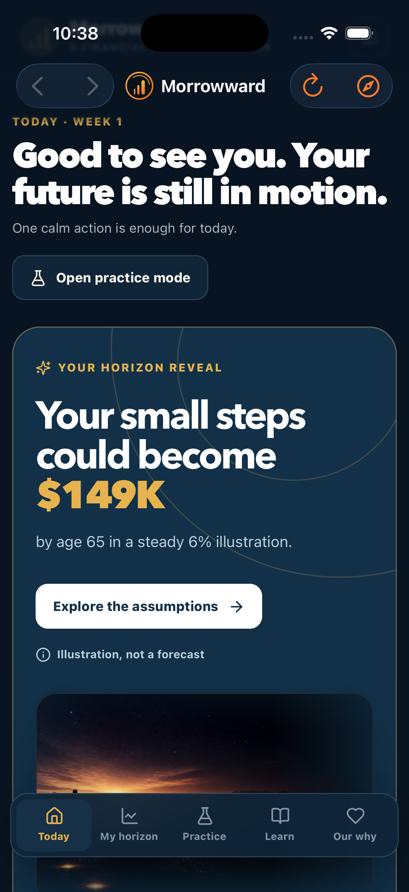 | 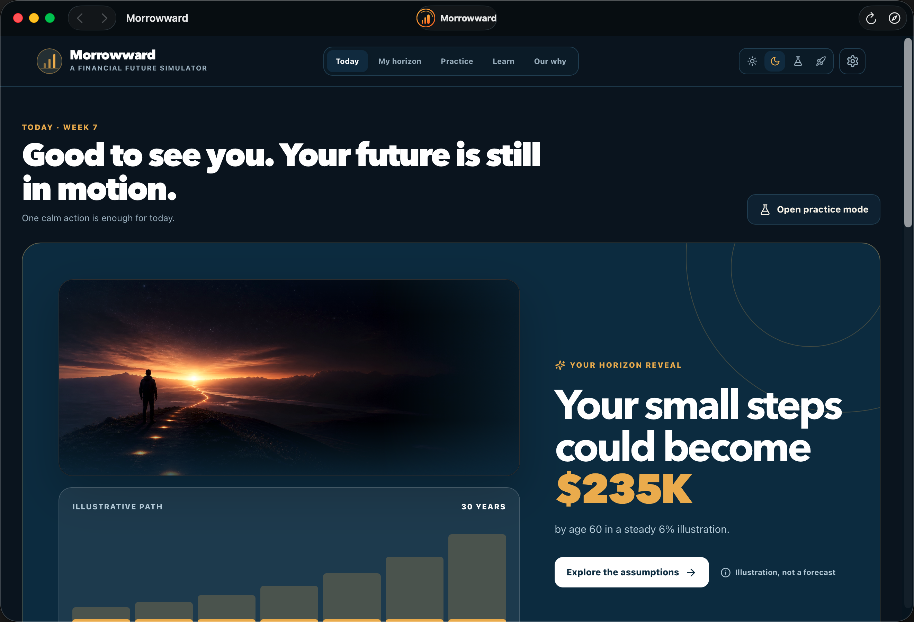 |

## Why it exists

At age ten, I was diagnosed with Type 1 diabetes and learned early that my future would require preparation. That same year, money saved from a paper route bought my first Commodore 64. Small daily experiments in BASIC started a path into technology that changed my life and my family’s future.

Morrowward carries that lesson into financial literacy: a modest action repeated for twenty years can change what feels possible. The product is designed to create hope and agency—not urgency, market hype, or a promise of returns.

## Product preview

These captures come from the stable production build and show the same responsive experience judges can open from the demo link above.

### Web experience

**Today · Horizon theme**

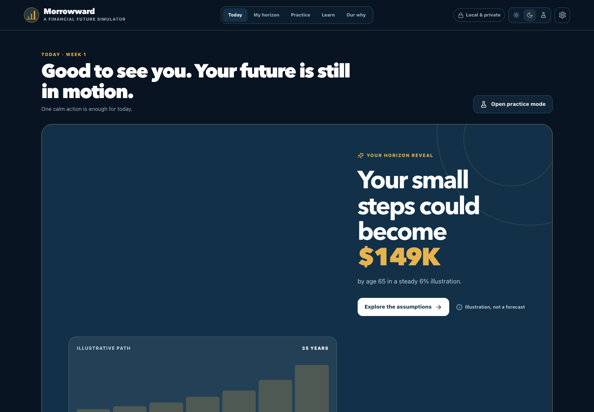

**My horizon · Dawn theme**

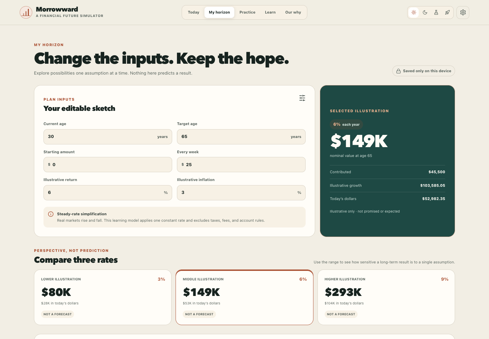

**Practice · Space theme**

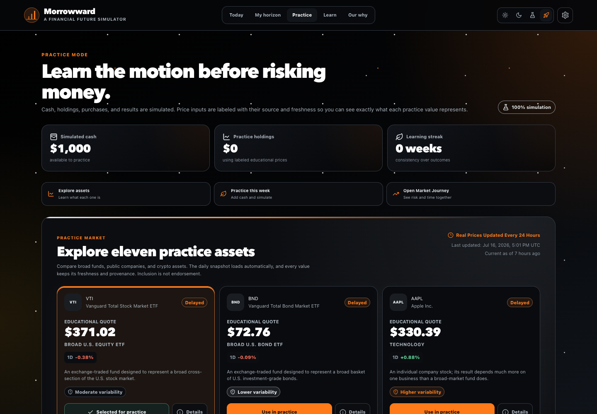

**Learn · Space theme**

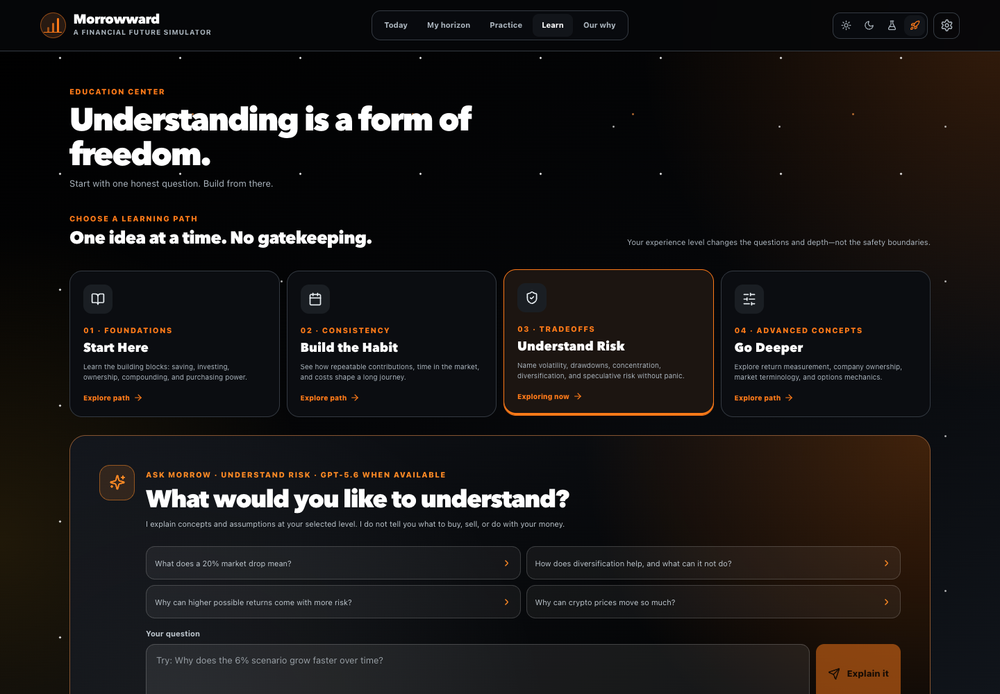

**Our why · Alchemy theme**

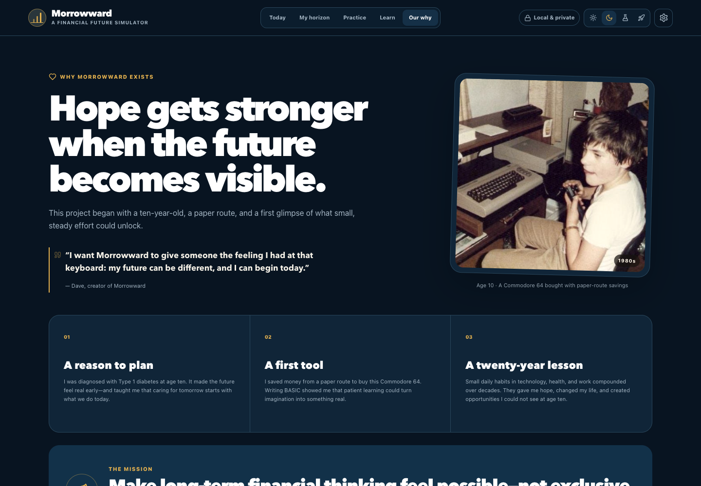

### Feature closeups

The daily briefing keeps verified facts, frontier-asset context, uncertainty, sources, and the hypothetical $100K learning lens visibly separated.

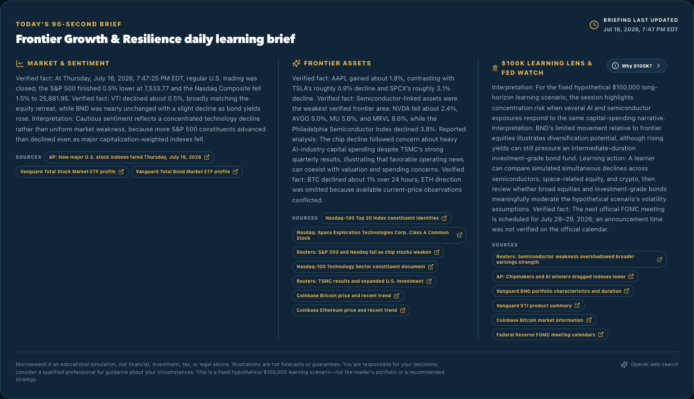

| Market Journey lab | SPCX educational detail sheet |
| --- | --- |
| 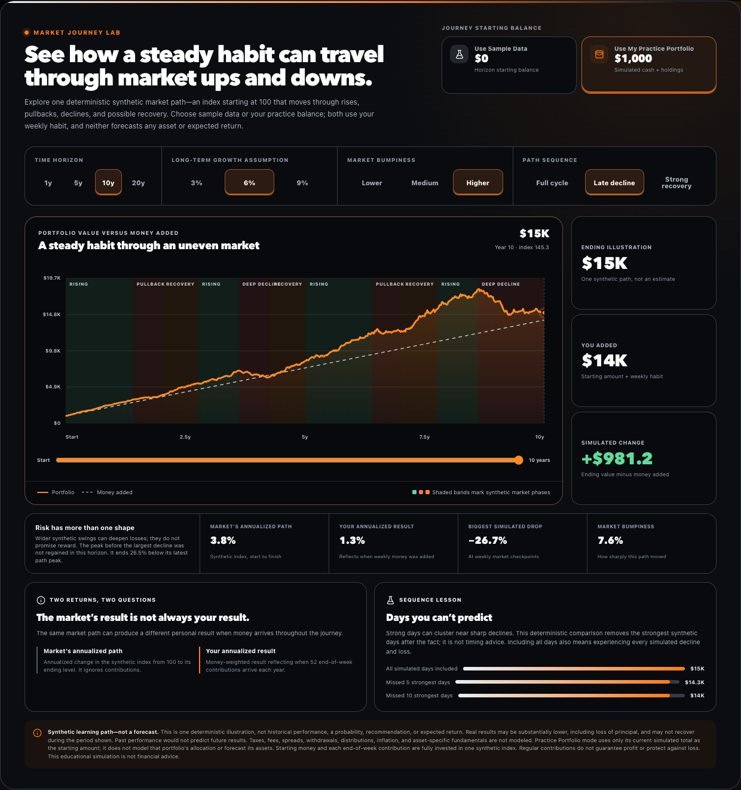 | 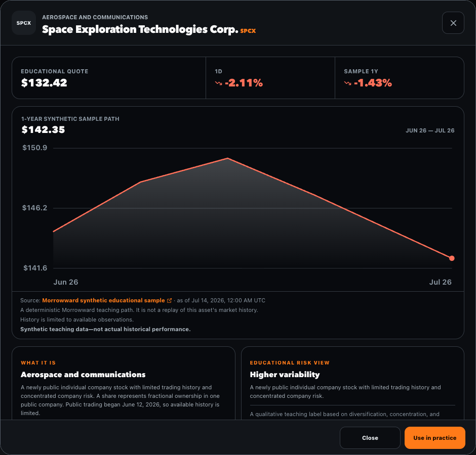 |

### Responsive mobile experience

| Today · Horizon | My horizon · Dawn |
| --- | --- |
| 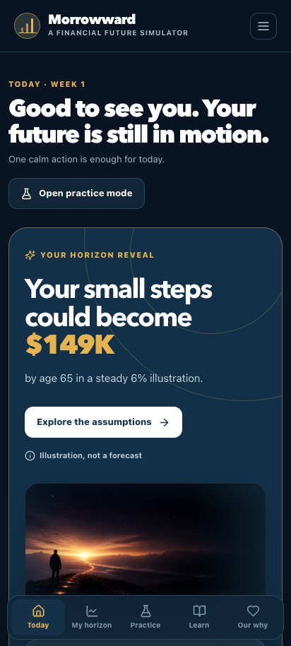 | 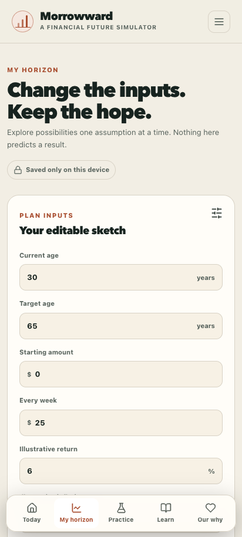 |

| Practice · Alchemy | Learn · Space |
| --- | --- |
| 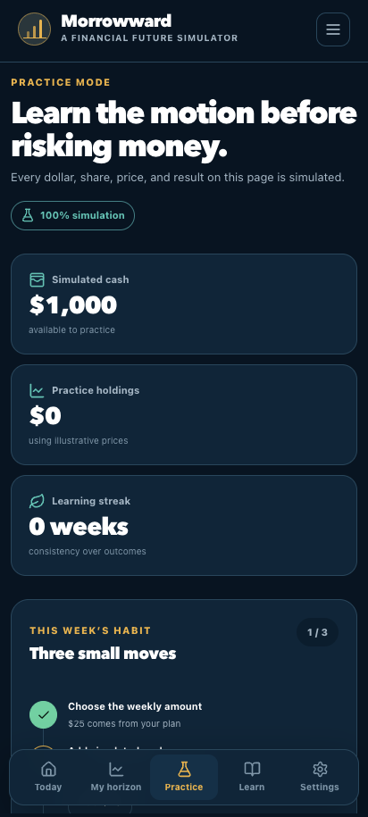 | 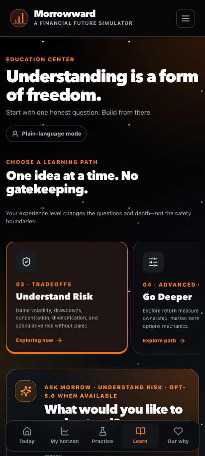 |

| Our why · Space | SPCX detail · Alchemy |
| --- | --- |
| 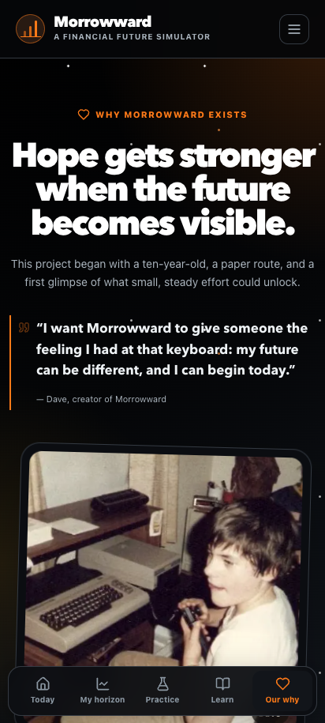 | 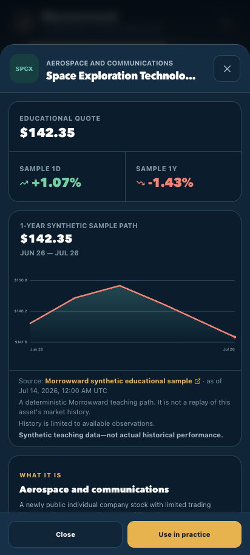 |

The native companion captures and their verification evidence are documented with the fresh shared source in the [Apple companion project](apple/README.md).

## What works

- Beginner-first onboarding with **New**, **Familiar**, and **Advanced** depth
- **Dawn**, **Horizon**, **Alchemy**, and **Space** visual themes
- Editable age, horizon, starting balance, weekly contribution, return, and inflation inputs
- 3%, 6%, and 9% default illustrative projection scenarios
- Nominal value, inflation-adjusted value, contributions, and estimated growth
- A deterministic Market Journey lab with 1-, 5-, 10-, and 20-year views, sample-versus-practice starting balances, independent return and market-swing controls, and bull/bear/recovery learning paths
- Separate market CAGR and contribution-aware money-weighted return, plus maximum drawdown and recovery context
- A “days you cannot predict” comparison showing the same synthetic path with all days versus its strongest simulated days removed
- Weekly habit streaks and milestones
- Simulated cash and precise fractional practice purchases for VTI, BND, AAPL, TSLA, SPCX, NVDA, MRVL, MU, AVGO, BTC, and ETH
- Current market quotes via GPT-5.6 web search, refreshed daily, with source, last-successful-update time, freshness, and change-basis labels
- Accessible asset-detail sheets with plain-language descriptions, qualitative risk context, and a bounded one-year price path
- One protected GPT-5.6 web-search batch for the fixed eleven-asset universe; deterministic synthetic values remain the offline fallback
- Four Education Center paths—**Start Here**, **Build the Habit**, **Understand Risk**, and **Go Deeper**—with 48 questions tailored across New, Familiar, and Advanced modes
- A multi-source learning library that labels regulator/government material as canonical, industry research separately, and Grokipedia as supplemental reading
- Structured GPT-5.6 explanations with a title, key ideas, assumptions, a safe simulator activity, and deterministic related questions
- Guided questions send an explicit bounded education topic; freeform questions are classified locally without sending holdings, balances, or identity
- A once-daily, source-backed GPT-5.6 market briefing rendered as exactly three sections: **Market & sentiment**, **Frontier assets**, and **$100K learning lens & Fed watch**
- Two optional 15-second historical welcomes with explicit playback, captions, transcripts, primary quote sources, visible AI disclosures, stable randomized assignment, permanent Mission replay, and a versioned approved-greeting roster
- Versioned IndexedDB persistence with automatic in-memory fallback
- Validated JSON export, import, and complete local reset
- Installable PWA shell with useful offline fallbacks
- No account, birthdate, brokerage credential, or real transaction path

The complete simulator works without an OpenAI key, a brokerage account, or network access. GPT-5.6 adds optional explanations, a source-backed daily briefing, and a source-backed daily public-quote snapshot; tested code owns every financial calculation. If a sourced briefing is not available, the Today page serves a safe evergreen edition that makes no current-market claims.

## Quick start

### Prerequisites

- Node.js 22.13 or newer
- npm 11 or newer recommended
- Google Chrome when running the optional Playwright end-to-end suite

### Run locally

```bash
git clone https://github.com/disbitski/morrowward.git
cd morrowward
npm install
cp .env.example .env.local
npm run dev
```

The public clone URL becomes available on July 20; until then, this command works only for an authorized collaborator. Open the local URL shown in the terminal. An API key is optional.

### Optional GPT-5.6 features

Set this only in `.env.local` or your hosting provider’s encrypted environment settings:

```bash
OPENAI_API_KEY=your_project_key
```

Never prefix the variable with `NEXT_PUBLIC_` and never place the key in browser code. The server currently uses the explicit hackathon model alias `gpt-5.6` for the educator, protected daily briefing, and protected daily quote-snapshot generator. The educator and quote panel have deterministic fallbacks; the briefing has a source-linked evergreen edition that deliberately avoids live claims when a current edition cannot be verified.

For the protected brief and quote generation endpoints, also set a long random secret:

```bash
CRON_SECRET=replace_with_a_long_random_value
```

Vercel Cron calls `GET /api/v1/briefs/generate` and `GET /api/v1/quotes/generate` and sends this value as an `Authorization: Bearer …` header. `ADMIN_API_TOKEN` is an optional second bearer token for an operator-controlled server-to-server trigger. Neither token belongs in browser code. Vercel invokes configured cron jobs only for Production deployments, not Preview deployments; protected hackathon previews therefore do not spend on scheduled runs. See Vercel's [Cron Jobs quickstart](https://vercel.com/docs/cron-jobs/quickstart) and [cron security guidance](https://vercel.com/docs/cron-jobs/manage-cron-jobs).

### Optional durable daily-content cache

The app always has safe brief and quote fallbacks. To share the last validated daily briefing and quote snapshot across Vercel cold starts, regions, and parallel instances, configure one complete REST credential pair:

```bash
# Vercel KV-compatible names
KV_REST_API_URL=https://your-store.example
KV_REST_API_TOKEN=your_token

# Or direct Upstash Redis names
UPSTASH_REDIS_REST_URL=https://your-store.example
UPSTASH_REDIS_REST_TOKEN=your_token
```

If both complete pairs are present, the `KV_REST_API_*` pair takes precedence. Content is schema-validated before storage and after retrieval. The briefing and quote snapshot each use a shared latest-successful-edition key and expire after 48 hours. A five-minute date-scoped briefing lease collapses concurrent protected invocations while allowing deliberate recovery from a failed publication; the separate quote retry guard remains twelve hours because normal public quote reads can start background recovery. Store operations time out after 1.5 seconds and fail closed to in-process/evergreen content, so Redis/KV is a durability enhancement rather than an availability dependency. Without a durable store, generated content is not guaranteed to survive a serverless cold start.

The same complete Redis REST pair also enables atomic shared fixed-window rate limits across serverless instances. The educator has a conservative UTC-day AI circuit breaker that defaults to 100 provider-attempt requests and may be adjusted with `EDUCATOR_DAILY_AI_REQUEST_LIMIT` (bounded in code). Prompt injection, sensitive identifiers, personalized trading requests, and crisis/debt/tax guardrails are handled locally before this daily quota; provider failures still count after a slot is reserved. A Vercel Production deployment with OpenAI enabled refuses model-eligible educator work unless a complete durable credential pair is present. When that store is unavailable, those potentially cost-bearing requests fail closed. Preview/local deployments with no durable configuration and deterministic no-key use retain the bounded in-memory limiter.

The preview uses a dedicated prepaid OpenAI API project with auto-recharge disabled and a $10 project budget. That dashboard setting is operational protection, not an absolute code-enforced cap because usage reporting can be delayed.

### Automatic daily quote snapshot

Practice updates automatically. A protected Production cron runs once per UTC day after the regular U.S. equity session and asks GPT-5.6 to gather the full fixed allowlist—VTI, BND, AAPL, TSLA, SPCX, NVDA, MRVL, MU, AVGO, BTC, and ETH—in one Responses API batch. The request uses required hosted `web_search`, `reasoning: { effort: "low" }`, `store: false`, strict structured output, source metadata, and at most one search tool call. The server rejects memory-only or malformed results, validates each returned instrument and its evidence, and uses an explicit per-symbol synthetic fallback when a current supported value is unavailable. No user's plan, balance, holdings, transactions, question, or identity is included; the request contains only the fixed public asset list and data contract.

The cron is primary, with a guarded self-healing path for missed runs: when the normal quote route finds no usable daily snapshot, the first request may start the same batch in the background. An in-process singleflight collapses concurrent work in one warm runtime, and the configured Redis/KV store adds a 12-hour distributed `NX` retry guard across instances. Other visitors immediately receive the last saved snapshot or deterministic fallback while generation finishes. The initiating Practice screen performs only two bounded, read-only rechecks—about 8 and 28 seconds after the first response—so a completed background snapshot can appear without a reload; those observation requests cannot start another generation. Normal reads reuse a successful snapshot for up to 24 hours, while the scheduled `GET` uses UTC-calendar-day cadence so near-boundary timing cannot make the cron skip every other day. Persistent failures retry no more frequently than once per 12 hours. Production should configure the durable store so that the snapshot and spend guard are shared across serverless instances.

After a successful refresh, the interface says **Real Prices Updated Every 24 Hours**—never “real-time”—and shows both the exact last-successful-update timestamp and its age in completed hours. Per-asset details retain source/citations when supplied, observation time, and freshness. URL citations are displayed for an asset only when the completed search call returned that URL and annotated that asset's quote object; hosted `oai-finance` evidence never receives an invented link. If the scheduled call, OpenAI, network, or durable store is unavailable, Practice remains usable with clearly labeled deterministic synthetic values; a synthetic one-year chart is never represented as actual historical performance.

OpenAI documents that Responses API web search can return sourced citations and source records labeled `oai-finance`. The application preserves clickable URL citations when provided and never invents a URL for a hosted source that does not expose one. At the documented price at build time, web search is $10 per 1,000 calls—$0.01 for the normal successful daily search—plus GPT-5.6 model and search-content tokens. With the durable retry guard configured, persistent failures can attempt at most once per 12 hours, so the search-tool portion is bounded to roughly $0.02 per day before tokens during an outage. See OpenAI's [web-search guide](https://developers.openai.com/api/docs/guides/tools-web-search) and [API pricing](https://developers.openai.com/api/docs/pricing). This is a bounded operating design, not a guarantee that API pricing or usage reporting cannot change.

### Automatic daily market briefing

A second protected Production cron calls `GET /api/v1/briefs/generate` once per day at `0 12 * * *` (12:00 UTC). The route allows up to **150 seconds** for the source-gathering Responses API job; browser reads never wait for or start that job. GPT-5.6 must use hosted web search, `store: false`, low reasoning effort, strict structured output, supplied source records, and no more than four search calls. The server accepts RFC 3339 timestamps, including numeric offsets, when no more than 36 hours old and no more than 15 minutes in the future. Citation matching removes only known click-tracking parameters and normalizes AP News links only when their stable 32-character article IDs match. Unsupported sentences are omitted, unsupported internal asset checks become unavailable, and the edition is rejected unless all three sections retain source-bound copy. Malformed output, unsupported Federal Reserve dates, individualized trading language, guarantees, and urgency still fail closed.

The request contains only public, fixed context: the request time and Eastern time zone; the S&P 500, Nasdaq Composite, VTI, and BND benchmarks; the AAPL, TSLA, SPCX, NVDA, MRVL, MU, AVGO, BTC, and ETH watchlist; and a hypothetical **$100,000 Frontier Growth & Resilience** learning scenario. It never contains a visitor's plan, starting balance, simulated cash, holdings, transactions, educator question, identity, or health story. The $100,000 figure is a round educational case study—not a recommended portfolio size, a model allocation, or a claim about the reader. Its teaching purpose is to make the mechanics of accumulated principal and compounding tangible; Investor.gov explains that compound interest is earned on both principal and accumulated interest and offers a [compound-interest calculator](https://www.investor.gov/financial-tools-calculators/calculators/compound-interest-calculator) plus a [savings-goal calculator](https://www.investor.gov/savings-goal-calculator). Whether any milestone is easy or hard depends on contributions, time, returns, fees, taxes, and risk.

The validated edition is rendered as exactly three concise, source-linked UI sections: **Market & sentiment**, **Frontier assets**, and **$100K learning lens & Fed watch**. A **Why $100K?** detail inside the third section explains the accumulated-principal effect with simple illustrative math, links to Investor.gov, and explicitly says the milestone is useful rather than magical or universally faster. The interface shows the last successful generation time instead of a refresh control. A valid edition is generated at most once per America/New_York calendar day, persisted as the shared latest edition for up to 48 hours, and never replaced by a failed run. If OpenAI, web search, the durable store, or source verification is unavailable, the public read returns the last valid edition when available; otherwise it serves a source-linked evergreen edition with no current prices, headlines, sentiment conclusions, or inferred Federal Reserve schedule.

## Repeatable sample demo

No live market conditions are needed. A clean browser begins with these local defaults:

| Field | Sample value |
| --- | ---: |
| Experience | New |
| Theme | Horizon |
| Current age | 30 |
| Target age | 65 |
| Starting balance | $0 |
| Weekly contribution | $25 |
| Central illustration | 6% |
| Inflation illustration | 3% |
| Simulated starting cash | $1,000 |

Complete onboarding, add the weekly simulated contribution, practice a fractional purchase, explore the 10-year Market Journey, then ask: **“Why can missing a few strong days matter?”**

## Architecture

```text
Browser / installed PWA
├── deterministic projection + synthetic market-path + practice engines
├── versioned IndexedDB state (plan, preferences, simulation only)
├── export / import / reset
└── bounded API calls with minimal context
    ├── education explanation → GPT-5.6 or deterministic fallback
    ├── daily brief → last validated GPT-5.6 web-sourced edition
    │                 or evergreen no-current-claims fallback
    └── daily quotes → shared validated GPT-5.6 web-search snapshot
                       or labeled deterministic synthetic fallback
```

### Finance domain

Money crosses the domain boundary as integer cents and rates as integer basis points. Fractional practice holdings use integer micro-units. Projection math converts an effective annual rate into an effective weekly rate, applies end-of-week contributions, rounds stored monetary values to cents, and checks JavaScript safe-integer limits.

The Market Journey is a second deterministic teaching model, not a forecast or a replay of a named asset. Its two starting-balance choices let someone use Sample Data from the Horizon plan or the current total of simulated cash plus marked-to-price Practice holdings. A funded Practice portfolio becomes the automatic initial choice; Sample Data remains the default when the Practice balance is zero, and the user can switch either way. The selection changes only the opening dollar amount—it never treats the Practice allocation as a forecast. The lab keeps the long-term return assumption separate from market bumpiness, generates a reproducible synthetic daily path with weekly contribution checkpoints, and does not force the path to finish at the selected assumption. The interface distinguishes the unitized market path’s CAGR from the contribution-aware money-weighted return and measures drawdown at visible weekly market checkpoints so deposits cannot hide a decline. A late-downturn path intentionally demonstrates that recovery is not guaranteed by the selected horizon.

The asset-detail interface separates the daily sourced snapshot from its bounded teaching path. It labels limited or synthetic history and does not describe price change as investor total return. The deterministic fallback chart and disclosure explicitly say it is not actual historical performance.

The pure domain layer is shared by projections, practice transactions, portfolio valuation, habit milestones, persistence validation, and tests.

### Local persistence

Dexie provides versioned IndexedDB storage. The single local state intentionally contains no name, email, birthdate, account identifier, brokerage token, or health data. If IndexedDB is blocked or unavailable, the app remains usable in memory and reports that limitation without retaining raw browser errors.

Imports are capped at 1 MB, wrapped in a versioned export envelope, validated strictly with Zod, and migrated only from known schema versions.

### GPT-5.6 boundary

The server calls the OpenAI Responses API using:

- `model: "gpt-5.6"`
- `store: false`
- strict `text.format` JSON Schema outputs
- feature-specific abort deadlines and bounded output tokens; the protected daily briefing has a 150-second function/request window because its required web research can take longer than an interactive explanation
- Zod validation after JSON parsing
- prompt-injection checks and generated-content safety checks
- feature-specific minimal context: the educator can receive years, weekly contribution, illustrative return, and illustrative inflation; the briefing receives only its fixed public watchlist, request time, and $100,000 learning scenario
- feature-appropriate safe fallbacks whenever the key, network, model, or schema is unavailable

The daily quote generator adds required `web_search`, `reasoning: { effort: "low" }`, source metadata, and a maximum of one search tool call. It batches the fixed eleven-symbol allowlist into one request, accepts only completed search-backed values that pass strict identity, timestamp, source, and response-schema checks, and never asks the model to calculate portfolio or projection values. Equities/ETFs allow a long-weekend observation window; crypto requires a much newer observation. Regular quote reads reuse the generated snapshot; only a guarded missing/stale first-load recovery may start generation, with singleflight and a 12-hour distributed retry guard preventing duplicate or rapid repeated work.

The model never receives the local portfolio, transaction history, starting balance, identity, or medical story. The quote job sends only the fixed public asset allowlist and quote schema. It cannot execute trades. Obvious Social Security, payment-card, bank-account, routing, passport, and government-ID patterns are rejected before an educator request. This is a defensive filter, not a promise to detect every kind of private information.

`store: false` tells the Responses API not to retain the response as application state; it does **not** mean zero data retention. Under OpenAI's default API controls, prompts and responses may be included in abuse-monitoring logs retained for up to 30 days (or longer when legally required). Eligible API organizations can apply for Modified Abuse Monitoring or Zero Data Retention. OpenAI states that API data is not used to train its models by default unless the organization explicitly opts in. See [OpenAI API data controls](https://platform.openai.com/docs/models/default-usage-policies-by-endpoint), [GPT-5.6 model](https://developers.openai.com/api/docs/models/gpt-5.6-sol), [Structured Outputs](https://developers.openai.com/api/docs/guides/structured-outputs), and [Responses API migration](https://developers.openai.com/api/docs/guides/migrate-to-responses). The concise project privacy disclosure is in [docs/PRIVACY.md](docs/PRIVACY.md).

### Safety behavior

- Personalized buy/sell/hold/allocation questions receive an educational boundary response.
- Tax, serious debt, and crisis questions are redirected to appropriate human or official support.
- Attempts to reveal or override model safeguards are rejected before an API call.
- Questions containing obvious account, card, SSN, or government-ID patterns are rejected before an API call.
- AI-generated content is discarded if it contains recommendation, urgency, guarantee, or risk-free language.
- State-changing routes require `application/json` and reject cross-site browser requests using `Origin` and Fetch Metadata checks. Localhost, forwarded hosts, and configured Vercel deployment origins are recognized.
- Requests are length-limited and rate-limited by an ephemeral hash of the client address; changing `User-Agent` does not create a new bucket, and raw addresses are not stored.
- All educational responses repeat the non-advice disclosure.

The approach follows OpenAI’s recommendation to combine model safeguards with application-level validation and oversight: [OpenAI safety best practices](https://developers.openai.com/api/docs/guides/safety-best-practices).

### Codex-led specialist media

The approved Marcus Aurelius and Benjamin Franklin welcomes demonstrate a second kind of agentic workflow. Codex on GPT-5.6 designed and ran a fresh, hackathon-local campaign pipeline, delegated image, video, and built-in narration generation to xAI models suited to those media jobs, then independently inspected the original-resolution candidates and complete motion sequences against committed hard gates. Dave retained the final human approval gate.

The Franklin pass also records why human judgment matters. Codex selected image 3 from four fresh 2816×1584 stills with a 30/30 review. The first Grok animation had minor incidental, nonsynchronized mouth motion and passed the complete frame review at 29/30. A stricter retry produced more pronounced facial and mouth movement and was rejected; a technically valid deterministic still-motion fallback was also rejected because its creative result did not work. Dave chose the stronger first animation after reviewing the complete composition. Morrowward does not present Franklin as speaking: provider-video audio is discarded, a separate xAI built-in **Sal** narrator supplies the disclosed voice track, captions reproduce the exact transcript, and the interface labels the figure as an AI-generated historical interpretation. The quotation “Little strokes fell great oaks.” was checked against [Founders Online, *Poor Richard Improved, 1750*](https://founders.archives.gov/documents/Franklin/01-03-02-0176); only archival capitalization, comma, and line-break formatting were normalized.

Both assets are optional and never call xAI at runtime. Sanitized publication manifests for [Marcus Aurelius](public/morrowward-marcus-welcome.publication.json) and [Benjamin Franklin](public/morrowward-franklin-welcome.publication.json) bind the exact MP4, captions, and poster hashes to each transcript, primary quotation source, model provenance, AI-interpretation disclosures, and final approval. One approved greeting is randomly assigned once per browser and saved locally so the experience remains stable; playback is always user initiated, and the assigned welcome can be replayed from Our Why. The reproducible generation and validation workflow lives in [`scripts/grok`](scripts/grok/README.md); raw provider responses and rejected candidates remain outside Git in ignored private review storage.

## API

| Method | Route | Behavior |
| --- | --- | --- |
| `GET` | `/api/v1/health` | Deployment, AI-configuration, quote-snapshot, durable-store, and privacy status |
| `GET` | `/api/v1/quotes` | Requested allowlisted quotes from the shared daily snapshot or synthetic fallback, with provenance |
| `GET` | `/api/v1/quotes/generate` | Protected scheduled generation of one complete eleven-symbol snapshot; bearer `CRON_SECRET` or `ADMIN_API_TOKEN`, no request body |
| `POST` | `/api/v1/quotes/generate` | Protected operator-controlled generation; same bearer authentication plus `Content-Type: application/json` |
| `POST` | `/api/v1/education/explain` | Bounded GPT-5.6 explanation or deterministic fallback |
| `GET` | `/api/v1/briefs/today` | Last validated three-section, source-backed edition or evergreen no-current-claims fallback; never starts generation |
| `GET` | `/api/v1/briefs/generate` | Protected once-daily scheduled GPT-5.6 web-search generation; 150-second function window; bearer `CRON_SECRET` or `ADMIN_API_TOKEN`, no request body |
| `POST` | `/api/v1/briefs/generate` | Protected operator-controlled generation using the same validation and idempotency boundary; bearer authentication plus `Content-Type: application/json` |

All three `POST` routes require `Content-Type: application/json`, and browser requests must be same-origin. Either operator generation request may use `{}` as its JSON body. Scheduled `GET` routes require neither content type nor body. Both generation endpoints require `Authorization: Bearer <CRON_SECRET-or-ADMIN_API_TOKEN>`; Vercel supplies the `CRON_SECRET` bearer header to configured cron invocations. Authenticated schedulers and other server-to-server callers may omit browser-only `Origin` and `Sec-Fetch-Site` headers.

```bash
# Scheduled/server-to-server GET (no body)
curl -H "Authorization: Bearer $CRON_SECRET" \
  https://your-deployment.example/api/v1/briefs/generate

curl -H "Authorization: Bearer $CRON_SECRET" \
  https://your-deployment.example/api/v1/quotes/generate

# Manual JSON POST
curl -X POST \
  -H "Authorization: Bearer $ADMIN_API_TOKEN" \
  -H "Content-Type: application/json" \
  -d '{}' \
  https://your-deployment.example/api/v1/quotes/generate
```

`GET /api/v1/briefs/today` first checks the optional Redis/KV latest-valid-brief key and never invokes OpenAI. `GET /api/v1/quotes` first checks the same store's shared latest-snapshot key. Every value is schema-validated after retrieval. A missing credential pair, timeout, unavailable store, or malformed stored value is treated as a cache miss; the routes continue with safe in-process/evergreen content. `GET /api/v1/health` reports only whether a complete durable-store pair is configured, never its URL or token.

`vercel.json` schedules the briefing job at `0 12 * * *` (12:00 UTC) and the quote job at `15 22 * * *` (22:15 UTC), after the regular U.S. equity session. Cron schedules use UTC. Vercel cron is Production-only, delivery is best effort, and duplicate or missed delivery is possible, so both generators are idempotent and replace validated shared snapshots instead of mutating user state. See Vercel's [Cron Jobs overview](https://vercel.com/docs/cron-jobs), [quickstart](https://vercel.com/docs/cron-jobs/quickstart), and [management notes](https://vercel.com/docs/cron-jobs/manage-cron-jobs).

With a complete Redis REST pair, rate limits use an atomic `EVAL` increment-and-expiry script, so per-client windows and the educator's 100-request UTC-day circuit breaker are shared across cold starts, regions, and parallel serverless instances. Production refuses any model-eligible educator attempt when OpenAI is enabled but a complete durable pair is missing or unavailable. Locally resolved safety and professional-support boundaries do not spend the daily AI quota. Preview/local deployments with no store configured use the bounded warm-runtime memory limiter. Per-client buckets prefer Vercel's platform `x-vercel-forwarded-for`, then `x-forwarded-for`, then `x-real-ip`; raw addresses are never stored. See Vercel's [request-header reference](https://vercel.com/docs/headers/request-headers). A platform-level Firewall/WAF remains useful defense in depth for unexpected public traffic.

### Education request

```json
{
  "question": "Why does starting earlier matter?",
  "experienceLevel": "new",
  "topic": "compounding",
  "context": {
    "yearsRemaining": 35,
    "weeklyContributionCents": 2500,
    "illustrativeReturnBps": 600,
    "illustrativeInflationBps": 300
  }
}
```

Every field is optional except `question`; unknown fields are rejected. The context is illustrative and deliberately excludes balances and holdings.

### Quote selection

```text
GET /api/v1/quotes?symbols=VTI,BND,BTC
GET /api/v1/quotes?symbols=SPCX&history=1y
```

Any symbol outside the eleven-asset practice allowlist is rejected. Reads select from the latest shared daily snapshot. If that snapshot is missing or stale, the first read may start one guarded background refresh while still returning saved or synthetic data; concurrent reads do not wait on it. The UI's bounded `observe=1` rechecks are read-only and cannot initiate generation. `history=1y` is bounded to exactly one allowlisted symbol and may return a clearly labeled deterministic synthetic teaching path; it is not presented as actual historical performance. Equities identify previous-close change when available, crypto may use a rolling 24-hour comparison, and every item includes source, observed time, market mode, freshness, and an educational profile. Values are updated daily for education and are not real-time or suitable for trading.

## Verification

```bash
npm test
npm run lint
npm run build
npm run test:render
npm run test:e2e
npm run build:vercel
```

`npm run test:e2e` starts the built vinext production bundle on port 4189 and runs the golden path, Market Journey controls, all four themes, offline PWA behavior, keyboard checks, and automated accessibility checks in both desktop Chrome and a Pixel 7 mobile viewport. Run `npm run build` first. Use `npm run test:e2e:list` to inspect the browser-test matrix without launching it.

The automated suite covers:

- Zero balance and zero contribution
- Short and multi-decade horizons
- Negative, fractional, and upper-bound illustrative rates
- Inflation-adjusted values and safe-integer overflow
- Projection invariants with property-based testing
- Deterministic market regimes, DCA cash-flow consistency, drawdown/recovery behavior, independent volatility, and strongest-day counterfactuals
- Simulated deposit, fractional purchase, overspending, valuation, and allocation
- Weekly streak and milestone behavior
- IndexedDB refresh, memory fallback, v1-to-v2 portfolio migration, malformed import, export/restore, and reset
- Required web-search enforcement, one-call quote batching, strict schema/source validation, durable snapshot reads/writes, partial failure, stale behavior, SPCX identity protection, and synthetic fallback labels
- Invalid JSON, oversized bodies, unknown quote symbols/history ranges, rate limits, cron/admin authorization, and safe generation failure
- Daily-brief source validation, exact three-section contracts, fixed $100,000 public context, once-per-day idempotency, durable last-valid retention, 150-second deadline configuration, and evergreen fallback behavior
- GPT timeout, invalid schema, unsafe generated advice, prompt injection, personalized advice, and no-key fallback

No test sends a real OpenAI request or places a real financial transaction.

## Install as an app

- **iPhone/iPad:** open the deployed site in Safari, choose Share, then **Add to Home Screen**.
- **macOS:** use the browser’s install option when available, or Safari’s **Add to Dock**.
- **Apple source companions:** follow the [Apple project instructions](apple/README.md) to run the iPhone target in Simulator or build the local unsigned Mac target.
- The installable experience uses the same local data and deterministic engine as the website.

## Educational sources

Morrowward summarizes concepts in original language and links outward for canonical detail:

- [Investor.gov introduction to investing](https://www.investor.gov/introduction-investing)
- [Investor.gov compound interest calculator](https://www.investor.gov/financial-tools-calculators/calculators/compound-interest-calculator)
- [Investor.gov asset allocation and diversification](https://www.investor.gov/introduction-investing/getting-started/asset-allocation)
- [Investor.gov dollar-cost averaging glossary](https://www.investor.gov/introduction-investing/investing-basics/glossary/dollar-cost-averaging)
- [Investor.gov stocks](https://www.investor.gov/introduction-investing/investing-basics/investment-products/stocks)
- [Investor.gov exchange-traded funds](https://www.investor.gov/introduction-investing/investing-basics/investment-products/mutual-funds-and-exchange-traded-2)
- [Investor.gov bulletin on performance claims and hypothetical results](https://www.investor.gov/introduction-investing/general-resources/news-alerts/alerts-bulletins/investor-bulletins-47)
- [U.S. Bureau of Labor Statistics: purchasing power and constant dollars](https://www.bls.gov/cpi/factsheets/purchasing-power-constant-dollars.htm)
- [FINRA risk](https://www.finra.org/investors/investing/investing-basics/risk)
- [FINRA volatility](https://www.finra.org/investors/investing/investing-basics/volatility)
- [Fidelity: the impact of missing a few strong market days](https://www.fidelity.com/learning-center/trading-investing/should-i-sell-my-stocks-now)
- [Charles Schwab: market volatility and missing top days](https://www.schwab.com/learn/story/ups-and-downs-stock-market-volatility)
- [J.P. Morgan Asset Management: strong and weak market days can occur close together](https://am.jpmorgan.com/us/en/asset-management/adv/insights/retirement-insights/navigating-market-volatility-retirement-guide/)
- [FINRA options basics](https://www.finra.org/investors/insights/options-z-basics-greeks)
- [FINRA crypto assets overview](https://www.finra.org/investors/investing/investment-products/crypto-assets/overview)
- [SpaceX IPO pricing release identifying SPCX](https://ir.spacex.com/updates/releases-details/2026/Space-Exploration-Technologies-Corp--Announces-Pricing-of-Initial-Public-Offering/default.aspx)
- [SEC SpaceX pricing filing](https://www.sec.gov/Archives/edgar/data/1181412/000162828026044955/spcx-pricing8xk.htm)

The Education Center also links directly to verified Grokipedia articles such as [compound interest](https://grokipedia.com/page/Compound_interest), [diversification](https://grokipedia.com/page/Diversification_(finance)), [inflation](https://grokipedia.com/page/Inflation), [ETFs](https://grokipedia.com/page/Exchange-traded_fund), [market timing](https://grokipedia.com/page/Market_timing), [cryptocurrency](https://grokipedia.com/page/Cryptocurrency), and [options](https://grokipedia.com/page/Option_(finance)). Every one is visibly labeled **Supplemental reading · Grokipedia** beside a primary or authoritative resource; no Grokipedia content is scraped or presented as canonical.

## How Codex accelerated the build

Codex was used for the majority of the project’s core functionality:

- Auditing reusable patterns and risks from earlier local-first dashboards
- Converting the product story into a bounded, testable MVP
- Designing deterministic finance and persistence contracts
- Implementing the responsive PWA and four-theme design system
- Implementing the GPT-5.6 request schema, fallback path, and application guardrails
- Generating unit, property, persistence, API, safety, browser, and accessibility checks
- Reviewing privacy boundaries, credential handling, degraded-network behavior, and documentation
- Orchestrating bounded subagents for market contracts, accessible UI, media tooling, integration, and adversarial review while the primary Sol session retained consolidation responsibility
- Maintaining the dated [build journal](docs/BUILD_JOURNAL.md) and a repeatable [demo script](docs/DEMO_SCRIPT.md)

Key decisions are documented in the build journal rather than hidden in a final retrospective. The separate [AI orchestration and media provenance note](docs/AI_ORCHESTRATION.md) explains the role boundaries, fresh xAI tooling, historical-figure disclosure, and human/Codex review gates.

## Deployment

The code supports two verified build targets:

- `npm run build:vercel` for the Vercel production deployment
- `npm run build` for the Vite/vinext Cloudflare-compatible preview build

Set secrets only through the hosting provider’s encrypted environment controls. The stable Production deployment is public-but-unannounced for integration testing; `NEXT_PUBLIC_ALLOW_INDEXING=false` keeps it out of normal search indexing during this period. Protected previews and `disbitski/morrowward` remain private through July 19, 2026. On July 20, indexing is enabled and the complete repository history becomes public for judging.

Vercel gives every commit deployment a unique immutable preview URL, so seeing that address change during the build is expected. The launch uses the stable production alias [morrowward.vercel.app](https://morrowward.vercel.app); later production deployments update behind that same URL. The README intentionally links the stable alias rather than a commit preview. See Vercel's [generated URL reference](https://vercel.com/docs/deployments/generated-urls).

## Roadmap

- Optional Robinhood read-only portfolio import using an official, user-controlled integration
- Options and LEAPS education with payoff simulation—not trade execution
- Email or notification delivery for daily educational briefs
- Deeper native iOS and macOS clients sharing the deterministic core; the Build Week deliverables are intentionally lightweight SwiftUI/WebKit companion shells
- Optional user-selectable educational data sources with explicit provenance and freshness contracts
- Optional ChatGPT companion through the Apps SDK/MCP model

## Repository guide

- `app/` — product UI and HTTP route handlers
- `src/domain/` — deterministic finance, practice, formatting, and habit logic
- `src/data/` — versioned local state and export/import
- `src/contracts/` — strict public API schemas
- `src/server/` — AI boundary, safety, rate limits, quotes, and briefs
- `tests/` — unit, property, persistence, and API safety tests
- `scripts/grok/` — fresh, consent-gated xAI media generation and validation pipeline
- `apple/` — one fresh shared SwiftUI/WebKit companion project with iPhone and Mac targets
- `docs/` — build journal, project description, demo script, and submission checklist

## License and attribution

Code is released under the [MIT License](LICENSE).

The childhood photograph is from Dave Isbitski’s personal archive and is covered by the separate [asset notice](NOTICE.md); the MIT license does not grant rights to reuse it outside this project.

Morrowward is an independent educational project. Asset names and trademarks belong to their respective owners. The project is not affiliated with or endorsed by Robinhood, Vanguard, Apple, Tesla, SpaceX, NVIDIA, Marvell, Micron, Broadcom, Bitcoin, Ethereum, FINRA, the SEC, OpenAI, or xAI.
