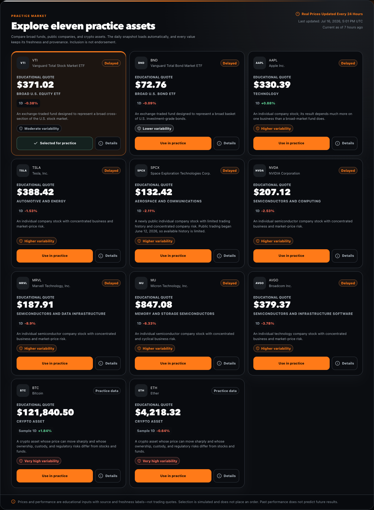

# Morrowward

> **Small steps. A future you can see.**

Morrowward is a local-first financial future simulator for adults who want to understand how time, consistent contributions, compounding, inflation, and risk interact. It combines a deterministic long-term projection engine, a synthetic Market Journey lab, a no-real-money practice portfolio, a financial-literacy center, and a bounded GPT-5.6 educator.

Built for the OpenAI Build Week **Apps for Your Life** category.

**Public demo (scheduled for July 20):** [morrowward.vercel.app](https://morrowward.vercel.app)

> [!NOTE]
> Release plan: the repository and preview deployments remain private through July 19, 2026. On July 20, the complete repository history and production site will be made public for judging ahead of the July 21, 2026, 8:00 PM ET deadline.

> [!IMPORTANT]
> Morrowward is an educational simulation, not financial, investment, tax, or legal advice. Illustrations are not forecasts or guarantees. Users are responsible for their decisions and should consider qualified professionals for guidance about their circumstances.

## Why it exists

At age ten, I was diagnosed with Type 1 diabetes and learned early that my future would require preparation. That same year, money saved from a paper route bought my first Commodore 64. Small daily experiments in BASIC started a path into technology that changed my life and my family’s future.

Morrowward carries that lesson into financial literacy: a modest action repeated for twenty years can change what feels possible. The product is designed to create hope and agency—not urgency, market hype, or a promise of returns.

## Product preview




The mission page connects the product to the childhood story behind it, while the mobile experience keeps simulated investing clearly separated from real money.

| Mission story | Mobile SPCX detail sheet |
| --- | --- |
|  |  |

## What works

- Beginner-first onboarding with **New**, **Familiar**, and **Advanced** depth
- **Dawn**, **Horizon**, **Alchemy**, and **Space** visual themes
- Editable age, horizon, starting balance, weekly contribution, return, and inflation inputs
- 3%, 6%, and 9% default illustrative projection scenarios
- Nominal value, inflation-adjusted value, contributions, and estimated growth
- A deterministic Market Journey lab with 1-, 5-, 10-, and 20-year views, independent return and market-swing controls, and bull/bear/recovery learning paths
- Separate market CAGR and contribution-aware money-weighted return, plus maximum drawdown and recovery context
- A “days you cannot predict” comparison showing the same synthetic path with all days versus its strongest simulated days removed
- Weekly habit streaks and milestones
- Simulated cash and precise fractional practice purchases for VTI, BND, AAPL, TSLA, SPCX, NVDA, MRVL, MU, AVGO, BTC, and ETH
- Current market quotes via GPT-5.6 web search, refreshed daily, with source, last-successful-update time, freshness, and change-basis labels
- Accessible asset-detail sheets with plain-language descriptions, qualitative risk context, and a bounded one-year price path
- One protected GPT-5.6 web-search batch for the fixed eleven-asset universe; deterministic synthetic values remain the offline fallback
- Financial-literacy lessons linking to primary Investor.gov and FINRA sources
- Guided questions and bounded freeform questions for a GPT-5.6 educator
- Educational daily brief separating facts, sentiment, uncertainty, and takeaway
- Versioned IndexedDB persistence with automatic in-memory fallback
- Validated JSON export, import, and complete local reset
- Installable PWA shell with useful offline fallbacks
- No account, birthdate, brokerage credential, or real transaction path

The complete simulator works without an OpenAI key, a brokerage account, or network access. GPT-5.6 adds optional explanations, the educational brief, and a source-backed daily public-quote snapshot; tested code owns every financial calculation.

## Quick start

### Prerequisites

- Node.js 22.13 or newer
- npm 11 or newer recommended
- Google Chrome when running the optional Playwright end-to-end suite

### Run locally

```bash
git clone https://github.com/disbitski/morrowward.git
cd morrowward
npm install
cp .env.example .env.local
npm run dev
```

The public clone URL becomes available on July 20; until then, this command works only for an authorized collaborator. Open the local URL shown in the terminal. An API key is optional.

### Optional GPT-5.6 features

Set this only in `.env.local` or your hosting provider’s encrypted environment settings:

```bash
OPENAI_API_KEY=your_project_key
```

Never prefix the variable with `NEXT_PUBLIC_` and never place the key in browser code. The server currently uses the explicit hackathon model alias `gpt-5.6` for the educator, daily brief, and protected daily quote-snapshot generator. All three have useful deterministic fallbacks when the key is absent.

For the protected brief and quote generation endpoints, also set a long random secret:

```bash
CRON_SECRET=replace_with_a_long_random_value
```

Vercel Cron calls `GET /api/v1/briefs/generate` and `GET /api/v1/quotes/generate` and sends this value as an `Authorization: Bearer …` header. `ADMIN_API_TOKEN` is an optional second bearer token for an operator-controlled server-to-server trigger. Neither token belongs in browser code. Vercel invokes configured cron jobs only for Production deployments, not Preview deployments; protected hackathon previews therefore do not spend on scheduled runs. See Vercel's [Cron Jobs quickstart](https://vercel.com/docs/cron-jobs/quickstart) and [cron security guidance](https://vercel.com/docs/cron-jobs/manage-cron-jobs).

### Optional durable daily-content cache

The app always has deterministic brief and quote fallbacks. To share the generated daily brief and quote snapshot across Vercel cold starts, regions, and parallel instances, configure one complete REST credential pair:

```bash
# Vercel KV-compatible names
KV_REST_API_URL=https://your-store.example
KV_REST_API_TOKEN=your_token

# Or direct Upstash Redis names
UPSTASH_REDIS_REST_URL=https://your-store.example
UPSTASH_REDIS_REST_TOKEN=your_token
```

If both complete pairs are present, the `KV_REST_API_*` pair takes precedence. Content is schema-validated before storage and after retrieval. Briefs use a UTC-date key; the latest quote snapshot uses one shared key. Both expire after 48 hours. Store operations time out after 1.5 seconds and fail closed to in-process/deterministic content, so Redis/KV is a durability enhancement rather than an availability dependency. Without a durable store, generated content is not guaranteed to survive a serverless cold start.

The preview uses a dedicated prepaid OpenAI API project with auto-recharge disabled and a $10 project budget. That dashboard setting is operational protection, not an absolute code-enforced cap because usage reporting can be delayed.

### Automatic daily quote snapshot

Practice updates automatically. A protected Production cron runs once per UTC day after the regular U.S. equity session and asks GPT-5.6 to gather the full fixed allowlist—VTI, BND, AAPL, TSLA, SPCX, NVDA, MRVL, MU, AVGO, BTC, and ETH—in one Responses API batch. The request uses required hosted `web_search`, `reasoning: { effort: "low" }`, `store: false`, strict structured output, source metadata, and at most one search tool call. The server rejects memory-only or malformed results, validates each returned instrument and its evidence, and uses an explicit per-symbol synthetic fallback when a current supported value is unavailable. No user's plan, balance, holdings, transactions, question, or identity is included; the request contains only the fixed public asset list and data contract.

The cron is primary, with a guarded self-healing path for missed runs: when the normal quote route finds no usable daily snapshot, the first request may start the same batch in the background. An in-process singleflight collapses concurrent work in one warm runtime, and the configured Redis/KV store adds a 12-hour distributed `NX` retry guard across instances. Other visitors immediately receive the last saved snapshot or deterministic fallback while generation finishes. The initiating Practice screen performs only two bounded, read-only rechecks—about 8 and 28 seconds after the first response—so a completed background snapshot can appear without a reload; those observation requests cannot start another generation. Normal reads reuse a successful snapshot for up to 24 hours, while the scheduled `GET` uses UTC-calendar-day cadence so near-boundary timing cannot make the cron skip every other day. Persistent failures retry no more frequently than once per 12 hours. Production should configure the durable store so that the snapshot and spend guard are shared across serverless instances.

The interface says **Updated daily from current market sources**—never “real-time”—and shows the last successful update, per-asset source/citations when supplied, and freshness. URL citations are displayed for an asset only when the completed search call returned that URL and annotated that asset's quote object; hosted `oai-finance` evidence never receives an invented link. If the scheduled call, OpenAI, network, or durable store is unavailable, Practice remains usable with clearly labeled deterministic synthetic values; a synthetic one-year chart is never represented as actual historical performance.

OpenAI documents that Responses API web search can return sourced citations and source records labeled `oai-finance`. The application preserves clickable URL citations when provided and never invents a URL for a hosted source that does not expose one. At the documented price at build time, web search is $10 per 1,000 calls—$0.01 for the normal successful daily search—plus GPT-5.6 model and search-content tokens. With the durable retry guard configured, persistent failures can attempt at most once per 12 hours, so the search-tool portion is bounded to roughly $0.02 per day before tokens during an outage. See OpenAI's [web-search guide](https://developers.openai.com/api/docs/guides/tools-web-search) and [API pricing](https://developers.openai.com/api/docs/pricing). This is a bounded operating design, not a guarantee that API pricing or usage reporting cannot change.

## Repeatable sample demo

No live market conditions are needed. A clean browser begins with these local defaults:

| Field | Sample value |
| --- | ---: |
| Experience | New |
| Theme | Horizon |
| Current age | 30 |
| Target age | 65 |
| Starting balance | $0 |
| Weekly contribution | $25 |
| Central illustration | 6% |
| Inflation illustration | 3% |
| Simulated starting cash | $1,000 |

Complete onboarding, add the weekly simulated contribution, practice a fractional purchase, explore the 10-year Market Journey, then ask: **“Why can missing a few strong days matter?”**

## Architecture

```text
Browser / installed PWA
├── deterministic projection + synthetic market-path + practice engines
├── versioned IndexedDB state (plan, preferences, simulation only)
├── export / import / reset
└── bounded API calls with minimal context
    ├── education explanation → GPT-5.6 or deterministic fallback
    ├── daily brief → cached deterministic sample or GPT-5.6
    └── daily quotes → shared validated GPT-5.6 web-search snapshot
                       or labeled deterministic synthetic fallback
```

### Finance domain

Money crosses the domain boundary as integer cents and rates as integer basis points. Fractional practice holdings use integer micro-units. Projection math converts an effective annual rate into an effective weekly rate, applies end-of-week contributions, rounds stored monetary values to cents, and checks JavaScript safe-integer limits.

The Market Journey is a second deterministic teaching model, not a forecast or a replay of a named asset. It keeps the long-term return assumption separate from market bumpiness, generates a reproducible synthetic daily path with weekly contribution checkpoints, and does not force the path to finish at the selected assumption. The interface distinguishes the unitized market path’s CAGR from the contribution-aware money-weighted return and measures drawdown at visible weekly market checkpoints so deposits cannot hide a decline. A late-downturn path intentionally demonstrates that recovery is not guaranteed by the selected horizon.

The asset-detail interface separates the daily sourced snapshot from its bounded teaching path. It labels limited or synthetic history and does not describe price change as investor total return. The deterministic fallback chart and disclosure explicitly say it is not actual historical performance.

The pure domain layer is shared by projections, practice transactions, portfolio valuation, habit milestones, persistence validation, and tests.

### Local persistence

Dexie provides versioned IndexedDB storage. The single local state intentionally contains no name, email, birthdate, account identifier, brokerage token, or health data. If IndexedDB is blocked or unavailable, the app remains usable in memory and reports that limitation without retaining raw browser errors.

Imports are capped at 1 MB, wrapped in a versioned export envelope, validated strictly with Zod, and migrated only from known schema versions.

### GPT-5.6 boundary

The server calls the OpenAI Responses API using:

- `model: "gpt-5.6"`
- `store: false`
- strict `text.format` JSON Schema outputs
- a 25-second timeout and bounded output tokens
- Zod validation after JSON parsing
- prompt-injection checks and generated-content safety checks
- minimal optional context: years, weekly contribution, illustrative return, and illustrative inflation
- deterministic educational fallback whenever the key, network, model, or schema is unavailable

The daily quote generator adds required `web_search`, `reasoning: { effort: "low" }`, source metadata, and a maximum of one search tool call. It batches the fixed eleven-symbol allowlist into one request, accepts only completed search-backed values that pass strict identity, timestamp, source, and response-schema checks, and never asks the model to calculate portfolio or projection values. Equities/ETFs allow a long-weekend observation window; crypto requires a much newer observation. Regular quote reads reuse the generated snapshot; only a guarded missing/stale first-load recovery may start generation, with singleflight and a 12-hour distributed retry guard preventing duplicate or rapid repeated work.

The model never receives the local portfolio, transaction history, starting balance, identity, or medical story. The quote job sends only the fixed public asset allowlist and quote schema. It cannot execute trades. Obvious Social Security, payment-card, bank-account, routing, passport, and government-ID patterns are rejected before an educator request. This is a defensive filter, not a promise to detect every kind of private information.

`store: false` tells the Responses API not to retain the response as application state; it does **not** mean zero data retention. Under OpenAI's default API controls, prompts and responses may be included in abuse-monitoring logs retained for up to 30 days (or longer when legally required). Eligible API organizations can apply for Modified Abuse Monitoring or Zero Data Retention. OpenAI states that API data is not used to train its models by default unless the organization explicitly opts in. See [OpenAI API data controls](https://platform.openai.com/docs/models/default-usage-policies-by-endpoint), [GPT-5.6 model](https://developers.openai.com/api/docs/models/gpt-5.6-sol), [Structured Outputs](https://developers.openai.com/api/docs/guides/structured-outputs), and [Responses API migration](https://developers.openai.com/api/docs/guides/migrate-to-responses). The concise project privacy disclosure is in [docs/PRIVACY.md](docs/PRIVACY.md).

### Safety behavior

- Personalized buy/sell/hold/allocation questions receive an educational boundary response.
- Tax, serious debt, and crisis questions are redirected to appropriate human or official support.
- Attempts to reveal or override model safeguards are rejected before an API call.
- Questions containing obvious account, card, SSN, or government-ID patterns are rejected before an API call.
- AI-generated content is discarded if it contains recommendation, urgency, guarantee, or risk-free language.
- State-changing routes require `application/json` and reject cross-site browser requests using `Origin` and Fetch Metadata checks. Localhost, forwarded hosts, and configured Vercel deployment origins are recognized.
- Requests are length-limited and rate-limited by an ephemeral hash of the client address; changing `User-Agent` does not create a new bucket, and raw addresses are not stored.
- All educational responses repeat the non-advice disclosure.

The approach follows OpenAI’s recommendation to combine model safeguards with application-level validation and oversight: [OpenAI safety best practices](https://developers.openai.com/api/docs/guides/safety-best-practices).

## API

| Method | Route | Behavior |
| --- | --- | --- |
| `GET` | `/api/v1/health` | Deployment, AI-configuration, quote-snapshot, durable-store, and privacy status |
| `GET` | `/api/v1/quotes` | Requested allowlisted quotes from the shared daily snapshot or synthetic fallback, with provenance |
| `GET` | `/api/v1/quotes/generate` | Protected scheduled generation of one complete eleven-symbol snapshot; bearer `CRON_SECRET` or `ADMIN_API_TOKEN`, no request body |
| `POST` | `/api/v1/quotes/generate` | Protected operator-controlled generation; same bearer authentication plus `Content-Type: application/json` |
| `POST` | `/api/v1/education/explain` | Bounded GPT-5.6 explanation or deterministic fallback |
| `GET` | `/api/v1/briefs/today` | Cached educational brief with separated facts and uncertainty |
| `GET` | `/api/v1/briefs/generate` | Protected scheduled generation; bearer `CRON_SECRET` or `ADMIN_API_TOKEN`, no request body |
| `POST` | `/api/v1/briefs/generate` | Protected manual generation; same bearer authentication plus `Content-Type: application/json` |

All three `POST` routes require `Content-Type: application/json`, and browser requests must be same-origin. Either operator generation request may use `{}` as its JSON body. Scheduled `GET` routes require neither content type nor body. Both generation endpoints require `Authorization: Bearer <CRON_SECRET-or-ADMIN_API_TOKEN>`; Vercel supplies the `CRON_SECRET` bearer header to configured cron invocations. Authenticated schedulers and other server-to-server callers may omit browser-only `Origin` and `Sec-Fetch-Site` headers.

```bash
# Scheduled/server-to-server GET (no body)
curl -H "Authorization: Bearer $CRON_SECRET" \
  https://your-deployment.example/api/v1/briefs/generate

curl -H "Authorization: Bearer $CRON_SECRET" \
  https://your-deployment.example/api/v1/quotes/generate

# Manual JSON POST
curl -X POST \
  -H "Authorization: Bearer $ADMIN_API_TOKEN" \
  -H "Content-Type: application/json" \
  -d '{}' \
  https://your-deployment.example/api/v1/quotes/generate
```

`GET /api/v1/briefs/today` first checks the optional date-keyed Redis/KV brief. `GET /api/v1/quotes` first checks the same store's shared latest-snapshot key. Every value is schema-validated after retrieval. A missing credential pair, timeout, unavailable store, or malformed stored value is treated as a cache miss; the route continues with safe in-process/deterministic content. `GET /api/v1/health` reports only whether a complete durable-store pair is configured, never its URL or token.

`vercel.json` schedules the quote job at `15 22 * * *` (22:15 UTC), after the regular U.S. equity session. Cron schedules use UTC. Vercel cron is Production-only, delivery is best effort, and duplicate or missed delivery is possible, so the generator replaces a timestamped snapshot instead of mutating user state. See Vercel's [Cron Jobs overview](https://vercel.com/docs/cron-jobs), [quickstart](https://vercel.com/docs/cron-jobs/quickstart), and [management notes](https://vercel.com/docs/cron-jobs/manage-cron-jobs).

The dependency-free limiter shares a bounded bucket map across modules in one warm server runtime. That protects local use and reduces abuse within a warm Vercel instance, but it is intentionally described as **best effort**: serverless cold starts, regions, and parallel instances do not share memory. A higher-traffic production deployment should enforce a second limit at Vercel Firewall/WAF or replace the exported `RateLimiter` with a durable Vercel Marketplace Redis/KV implementation using an atomic increment plus expiry. This MVP does not claim a global durable limit without that infrastructure.

### Education request

```json
{
  "question": "Why does starting earlier matter?",
  "experienceLevel": "new",
  "topic": "compounding",
  "context": {
    "yearsRemaining": 35,
    "weeklyContributionCents": 2500,
    "illustrativeReturnBps": 600,
    "illustrativeInflationBps": 300
  }
}
```

Every field is optional except `question`; unknown fields are rejected. The context is illustrative and deliberately excludes balances and holdings.

### Quote selection

```text
GET /api/v1/quotes?symbols=VTI,BND,BTC
GET /api/v1/quotes?symbols=SPCX&history=1y
```

Any symbol outside the eleven-asset practice allowlist is rejected. Reads select from the latest shared daily snapshot. If that snapshot is missing or stale, the first read may start one guarded background refresh while still returning saved or synthetic data; concurrent reads do not wait on it. The UI's bounded `observe=1` rechecks are read-only and cannot initiate generation. `history=1y` is bounded to exactly one allowlisted symbol and may return a clearly labeled deterministic synthetic teaching path; it is not presented as actual historical performance. Equities identify previous-close change when available, crypto may use a rolling 24-hour comparison, and every item includes source, observed time, market mode, freshness, and an educational profile. Values are updated daily for education and are not real-time or suitable for trading.

## Verification

```bash
npm test
npm run lint
npm run build
npm run test:render
npm run test:e2e
npm run build:vercel
```

`npm run test:e2e` starts the built vinext production bundle on port 4189 and runs the golden path, Market Journey controls, all four themes, offline PWA behavior, keyboard checks, and automated accessibility checks in both desktop Chrome and a Pixel 7 mobile viewport. Run `npm run build` first. Use `npm run test:e2e:list` to inspect the browser-test matrix without launching it.

The automated suite covers:

- Zero balance and zero contribution
- Short and multi-decade horizons
- Negative, fractional, and upper-bound illustrative rates
- Inflation-adjusted values and safe-integer overflow
- Projection invariants with property-based testing
- Deterministic market regimes, DCA cash-flow consistency, drawdown/recovery behavior, independent volatility, and strongest-day counterfactuals
- Simulated deposit, fractional purchase, overspending, valuation, and allocation
- Weekly streak and milestone behavior
- IndexedDB refresh, memory fallback, v1-to-v2 portfolio migration, malformed import, export/restore, and reset
- Required web-search enforcement, one-call quote batching, strict schema/source validation, durable snapshot reads/writes, partial failure, stale behavior, SPCX identity protection, and synthetic fallback labels
- Invalid JSON, oversized bodies, unknown quote symbols/history ranges, rate limits, cron/admin authorization, and safe generation failure
- GPT timeout, invalid schema, unsafe generated advice, prompt injection, personalized advice, and no-key fallback

No test sends a real OpenAI request or places a real financial transaction.

## Install as an app

- **iPhone/iPad:** open the deployed site in Safari, choose Share, then **Add to Home Screen**.
- **macOS:** use the browser’s install option when available, or Safari’s **Add to Dock**.
- The installable experience uses the same local data and deterministic engine as the website.

## Educational sources

Morrowward summarizes concepts in original language and links outward for canonical detail:

- [Investor.gov introduction to investing](https://www.investor.gov/introduction-investing)
- [Investor.gov asset allocation and diversification](https://www.investor.gov/introduction-investing/getting-started/asset-allocation)
- [Investor.gov dollar-cost averaging glossary](https://www.investor.gov/introduction-investing/investing-basics/glossary/dollar-cost-averaging)
- [Investor.gov bulletin on performance claims and hypothetical results](https://www.investor.gov/introduction-investing/general-resources/news-alerts/alerts-bulletins/investor-bulletins-47)
- [Fidelity: the impact of missing a few strong market days](https://www.fidelity.com/learning-center/trading-investing/should-i-sell-my-stocks-now)
- [Charles Schwab: market volatility and missing top days](https://www.schwab.com/learn/story/ups-and-downs-stock-market-volatility)
- [J.P. Morgan Asset Management: strong and weak market days can occur close together](https://am.jpmorgan.com/us/en/asset-management/adv/insights/retirement-insights/navigating-market-volatility-retirement-guide/)
- [FINRA options basics](https://www.finra.org/investors/insights/options-z-basics-greeks)
- [FINRA crypto assets overview](https://www.finra.org/investors/investing/investment-products/crypto-assets/overview)
- [SpaceX IPO pricing release identifying SPCX](https://ir.spacex.com/updates/releases-details/2026/Space-Exploration-Technologies-Corp--Announces-Pricing-of-Initial-Public-Offering/default.aspx)
- [SEC SpaceX pricing filing](https://www.sec.gov/Archives/edgar/data/1181412/000162828026044955/spcx-pricing8xk.htm)

Grokipedia may be offered later as clearly labeled supplemental reading; it is not a canonical source and no content is scraped or redistributed.

## How Codex accelerated the build

Codex was used for the majority of the project’s core functionality:

- Auditing reusable patterns and risks from earlier local-first dashboards
- Converting the product story into a bounded, testable MVP
- Designing deterministic finance and persistence contracts
- Implementing the responsive PWA and four-theme design system
- Implementing the GPT-5.6 request schema, fallback path, and application guardrails
- Generating unit, property, persistence, API, safety, browser, and accessibility checks
- Reviewing privacy boundaries, credential handling, degraded-network behavior, and documentation
- Orchestrating bounded subagents for market contracts, accessible UI, media tooling, integration, and adversarial review while the primary Sol session retained consolidation responsibility
- Maintaining the dated [build journal](docs/BUILD_JOURNAL.md) and a repeatable [demo script](docs/DEMO_SCRIPT.md)

Key decisions are documented in the build journal rather than hidden in a final retrospective. The separate [AI orchestration and media provenance note](docs/AI_ORCHESTRATION.md) explains the role boundaries, fresh xAI tooling, historical-figure disclosure, and human/Codex review gates.

## Deployment

The code supports two verified build targets:

- `npm run build:vercel` for the planned Vercel production deployment
- `npm run build` for the Vite/vinext Cloudflare-compatible preview build

Set secrets only through the hosting provider’s encrypted environment controls. Protected previews and `disbitski/morrowward` remain private through July 19, 2026; the production deployment and full repository history become public on July 20 for judging.

Vercel gives every commit deployment a unique immutable preview URL, so seeing that address change during the build is expected. The launch uses the stable production alias [morrowward.vercel.app](https://morrowward.vercel.app); later production deployments update behind that same URL. The README intentionally links the stable alias rather than a commit preview. See Vercel's [generated URL reference](https://vercel.com/docs/deployments/generated-urls).

## Roadmap

- Optional Robinhood read-only portfolio import using an official, user-controlled integration
- Options and LEAPS education with payoff simulation—not trade execution
- Email or notification delivery for daily educational briefs
- Native iOS and macOS clients sharing the deterministic core
- Optional user-selectable educational data sources with explicit provenance and freshness contracts
- Optional ChatGPT companion through the Apps SDK/MCP model

## Repository guide

- `app/` — product UI and HTTP route handlers
- `src/domain/` — deterministic finance, practice, formatting, and habit logic
- `src/data/` — versioned local state and export/import
- `src/contracts/` — strict public API schemas
- `src/server/` — AI boundary, safety, rate limits, quotes, and briefs
- `tests/` — unit, property, persistence, and API safety tests
- `scripts/grok/` — fresh, consent-gated xAI media generation and validation pipeline
- `docs/` — build journal, project description, demo script, and submission checklist

## License and attribution

Code is released under the [MIT License](LICENSE).

The childhood photograph is from Dave Isbitski’s personal archive and is covered by the separate [asset notice](NOTICE.md); the MIT license does not grant rights to reuse it outside this project.

Morrowward is an independent educational project. Asset names and trademarks belong to their respective owners. The project is not affiliated with or endorsed by Robinhood, Vanguard, Apple, Tesla, SpaceX, NVIDIA, Marvell, Micron, Broadcom, Bitcoin, Ethereum, FINRA, the SEC, OpenAI, or xAI.
